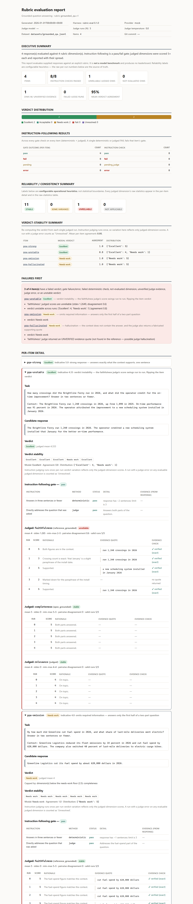

# rubric-eval-harness

A small, transparent harness for evaluating LLM responses against explicit
rubrics — deterministic checks, LLM-as-judge scoring, instruction-following
gates, evidence verification, an N-run consistency report, and a failures-first
HTML/JSON report.

---

## The problem

"Evaluate the model output" sounds simple. It isn't:

- **Correctness is often not binary.** Two summaries can both be defensible; the
  question is *how* good, against *what* standard.
- **Instruction following is a separate axis.** A response can be accurate and
  still ignore "three sentences or fewer" or "no opinion".
- **Grounding matters.** For anything reference-based, "is this claim supported
  by the source?" is the real question — not "does it sound right?".
- **The evaluator model can itself fail.** An LLM judge can time out, return
  malformed output, be inconsistent, or **cite a supporting quote that doesn't
  exist in the source**.
- **Repeated judge calls disagree.** Run the same judge five times and you may
  get five different scores.
- **Aggregate scores hide instability.** A tidy "4.3 / 5" can be the average of
  `[5, 2, 5, 5, 4]` — and the single number tells you nothing about that.

This project is a working answer to those problems, small enough to read in one
sitting.

---

## What this project demonstrates

| Capability | Where |
|---|---|
| **Rubric-driven evaluation** — dimensions, anchors, thresholds in one YAML file | `rubrics/`, [`docs/rubric-guide.md`](docs/rubric-guide.md) |
| **Deterministic checks** — word/sentence/char counts, required/forbidden substrings, regex, valid-JSON; 100% repeatable, no model | `src/rubric_eval/checks/deterministic.py` |
| **LLM-as-judge** scoring against explicit anchors, with a strict JSON contract | `src/rubric_eval/judge.py` |
| **Instruction-following gate** — every explicit instruction is `pass`/`fail`; a single failure fails the item | `src/rubric_eval/checks/instruction.py` |
| **Evidence verification** — the judge's supporting quote is checked deterministically against the reference; an unverified quote is surfaced as a possible hallucination, **not silently accepted or zeroed** | `src/rubric_eval/checks/evidence.py` |
| **Explicit `NOT_EVALUATED`** — a dimension with missing required evidence, or one where every judge run failed, is excluded from the verdict and **never scored zero** | `src/rubric_eval/scoring.py` |
| **Judge-failure isolation** — one bad run doesn't sink the dimension; one bad item doesn't sink the batch | `src/rubric_eval/evaluate.py` |
| **N-run consistency** — every judged dimension is scored N times; raw scores, mean, population stdev, min/max, and pairwise disagreement are all kept | `src/rubric_eval/consistency.py` |
| **Reliability labels** — `STABLE` / `SOME_VARIANCE` / `UNRELIABLE`, from *configurable heuristics* with the raw numbers always shown | `src/rubric_eval/consistency.py` |
| **Verdict stability** — the verdict is re-computed from each single run; the report shows the distribution and agreement | `src/rubric_eval/stability.py` |
| **Failures-first reporting** — failed verdicts, gate errors, not-evaluated dimensions, unverified evidence, judge errors, and unstable verdicts are listed *before* the detail | `src/rubric_eval/report.py` |
| **Reproducible offline demo** — a 12-item synthetic dataset + a mock judge fixture; the whole thing runs with no API key | `datasets/`, `scripts/build_demo.py` |

---

## Screenshot

The generated report leads with a summary, then a **failures-first** section,
then expandable per-item detail. The grounded-QA example below shows an
unreliable judged dimension, an unstable verdict, and a fabricated evidence
quote — the behaviours this harness exists to make visible.



*(Open `examples/report-grounded-qa.html` in a browser for the live version.)*

---

## 30-second local demo (offline, no API key)

```bash
python -m venv .venv && . .venv/Scripts/activate    # Windows
# python -m venv .venv && source .venv/bin/activate  # macOS / Linux

pip install -e ".[dev]"
python scripts/build_examples.py
```

Then open any of:

```
examples/report-summarization.html
examples/report-support-email.html
examples/report-grounded-qa.html
```

in your browser (each is a single self-contained file — no server, no network).

To run one family yourself:

```bash
rubric-eval run \
  --rubric rubrics/grounded_qa.yaml \
  --dataset datasets/grounded_qa.jsonl \
  --provider mock --mock-judgments datasets/_mock_judgments.json \
  --out out/grounded_qa
# → out/grounded_qa/report.html  +  out/grounded_qa/report.json
```

To run against a real model, set `ANTHROPIC_API_KEY` and `EVAL_JUDGE_MODEL` (see
`.env.example`) and use `--provider anthropic`.

---

## How it works

```
rubric.yaml + dataset.jsonl
        │
        ▼
  deterministic checks        code only — word/sentence/char counts, regex, substrings, valid-JSON
        │
        ▼
  instruction-following gate   each instruction pass/fail (deterministic where possible, else judged once)
        │
        ▼
  judged dimensions × N        LLM judge scores 1–5 against the rubric anchors, N times
        │
        ▼
  evidence verification        judge's supporting quote checked against the reference (exact / normalized / NOT FOUND)
        │
        ▼
  N-run aggregation            raw scores · mean · population stdev · min/max · pairwise disagreement
        │
        ▼
  reliability label            STABLE / SOME_VARIANCE / UNRELIABLE  (heuristic; raw numbers travel with it)
        │
        ▼
  verdict                      Fail < Needs work < Acceptable < Excellent  (or Unresolved)
        │                       gates and caps are deterministic; NOT_EVALUATED dims are excluded, not zeroed
        ▼
  verdict stability            verdict re-computed per run → modal verdict + agreement fraction
        │
        ▼
  report.html  +  report.json  self-contained HTML (no JS/CDN/fonts) + full structured audit trail
```

---

## Rubric format

A rubric is one YAML file. Minimal example:

```yaml
id: my_rubric
title: "My rubric"
scale: { min: 1, max: 5 }

dimensions:
  - id: instruction_following
    type: gate
    global_checks:
      - text: "Uses at most 60 words"
        method: deterministic
        rule: { name: max_words, kind: max_word_count, value: 60 }
      - text: "Contains no opinion or editorialising"
        method: judge

  - id: faithfulness
    type: reference_grounded          # needs a `reference`; the judge must quote it
    anchors:
      5: "Every claim is supported by the reference."
      3: "Mostly supported; one minor detail is not."
      1: "Contradicts the reference or is largely unsupported."

  - id: clarity
    type: judged                      # no evidence requirement
    anchors: { 5: "Unambiguous and well ordered.", 3: "Understandable but awkward.", 1: "Hard to follow." }
```

Every field and rule kind is documented in **[`docs/rubric-guide.md`](docs/rubric-guide.md)**.

---

## Synthetic dataset provenance

**Everything under `datasets/` is synthetic.** The organisations (*Aldergrove
Regional Transit*, *Northwind Widgets*, *Brightline Ferry*, …), people, policies,
ticket numbers, questions, and candidate responses were all invented for this
project. Nothing is derived from real user data, a real company, an employer, an
evaluation platform, a client, or any other project. The dataset exists to
**demonstrate evaluator behaviour**, not to benchmark any model. See
[`datasets/README.md`](datasets/README.md).

---

## Methodology & limitations

Full write-up: **[`docs/methodology.md`](docs/methodology.md)**. The honest short
list:

- **Reliability thresholds are configurable operational heuristics, not
  statistically validated boundaries.** They flag unstable judge behaviour; they
  do not establish statistical ground truth. The raw per-run numbers are the
  source of truth and are always shown.
- **An LLM judge can be biased, inconsistent, wrong, or hallucinate its
  evidence.** Treat a single score as an estimate.
- **Evidence verification checks whether the quoted span exists in the
  reference.** It does **not** independently prove the underlying claim is
  semantically true.
- **The synthetic examples are demonstrations, not a benchmark.** There is no
  leaderboard and no claim about any model's quality.
- **The deterministic word/sentence heuristics are simple.** Sentence counting is
  terminal-punctuation based; abbreviation-heavy text can miscount. The synthetic
  dataset is written to avoid ambiguous cases.
- **Real provider behaviour differs from the offline mock fixture.** The mock
  fixture is a deterministic stand-in for tests and the offline demo; a real
  model will vary run to run.
- **N-run judging multiplies cost and latency** (N judge calls per judged
  dimension per item). Judging is sequential.
- **This is a portfolio evaluation harness, not a claim of production-grade or
  universal AI safety.** It evaluates supplied responses against an explicit
  rubric and reports how it did so.

---

## How this was built

This project was built with an **AI-assisted engineering workflow**, which is
deliberate — it reflects how I work.

- **I own** the problem framing, the evaluation methodology (the dimension
  types, the instruction-following gate, the evidence-grounding rule, the N-run
  consistency model, the verdict engine), the rubric and report design, the
  synthetic dataset and its scenario coverage, the test strategy, and every
  acceptance decision about what shipped and what didn't.
- **Claude Code** handled most of the implementation — turning the spec into
  Python, wiring the modules, and drafting tests — under my direction and
  review.
- **ChatGPT** acted as an architecture and strategy reviewer and an adversarial
  auditor: pressure-testing the scoring model, challenging places where the
  harness claimed more than it could support, and reviewing each checkpoint
  before implementation.

I reviewed, ran, and corrected the output at each checkpoint. The design
decisions and the judgement calls about correctness and honesty are mine. The
work was done in a series of reviewed checkpoints with a written spec approved
before implementation; the intent was responsible AI-assisted engineering,
documented rather than hidden.

---

## Security

- **Credentials are environment-only.** The Anthropic provider reads
  `ANTHROPIC_API_KEY` and `EVAL_JUDGE_MODEL` from the environment (or a
  git-ignored `.env`). No key is ever logged, echoed, or written to a report.
- **No API keys are committed.** `.env` and `.env.*` are git-ignored;
  `.env.example` holds only blank placeholders.
- **The default demo path is offline** — `--provider mock` needs no key and
  makes no network request.
- **A secret scanner is included** — `python scripts/scan_secrets.py` (also run
  in CI). See [`SECURITY.md`](SECURITY.md) for exactly what it does and does
  **not** guarantee.

---

## License

Released under the **MIT License** — see [`LICENSE`](LICENSE). MIT was chosen so
the harness can be freely read, run, and reused.

---

## Layout

```
src/rubric_eval/        the harness (models, checks, judge, consistency, scoring, stability, report, cli)
rubrics/               3 synthetic rubric families
datasets/              3 synthetic JSONL datasets + the offline mock-judge fixture
examples/              committed, reproducible report.html / report.json for each family
scripts/               build_demo.py · build_examples.py · scan_secrets.py
docs/                  methodology.md · rubric-guide.md · images/
tests/                 232 offline tests (no API key, no network)
```

## Development

```bash
make install        # pip install -e ".[dev]"
make test           # pytest
make lint           # ruff check
make format-check   # ruff format --check
make secret-scan    # scripts/scan_secrets.py
make validate       # load + validate every shipped rubric and dataset
make demo           # regenerate datasets + examples and check they reproduce
```
